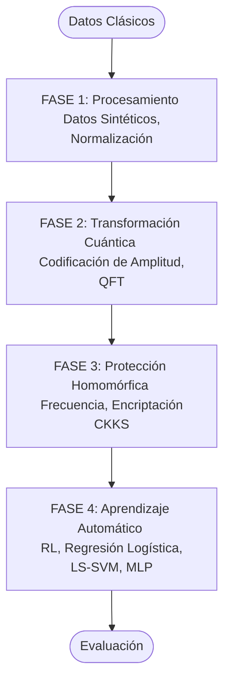
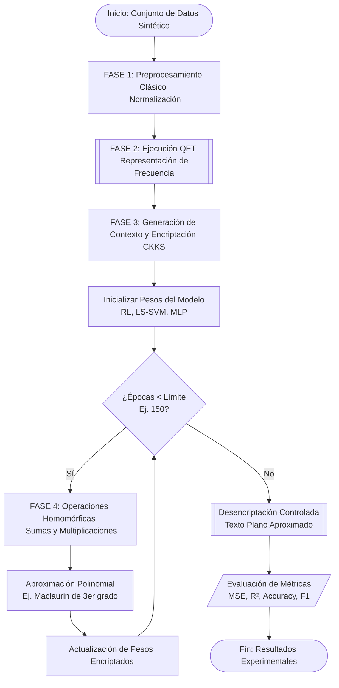
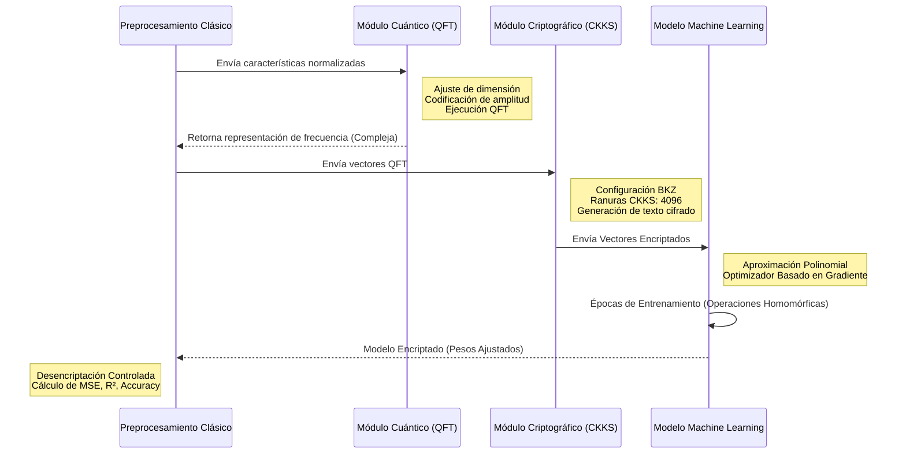

# Modelo de Arquitectura Cuántica-Clásica con Encriptación Homomórfica para Entrenamiento y Preservación de la Privacidad en el Aprendizaje Automático

Este repositorio contiene la implementación experimental del proyecto de investigación:
**"Modelo de Arquitectura Cuántica-Clásica con Encriptación Homomórfica para Entrenamiento y Preservación de la Privacidad en el Aprendizaje Automático".**

La arquitectura propuesta integra la **Transformada Cuántica de Fourier (QFT)** con el **esquema de encriptación homomórfica CKKS** para investigar el aprendizaje automático que preserva la privacidad sobre representaciones en el dominio de la frecuencia.

El flujo de trabajo experimental combina el preprocesamiento clásico, la transformación de características cuánticas, la encriptación homomórfica, el aprendizaje automático y la evaluación cuantitativa.

## 📌 Tabla de Contenidos
- [Descripción General](#-descripción-general)
- [Objetivo de la Investigación](#-objetivo-de-la-investigación)
- [Arquitectura del Sistema](#-arquitectura-del-sistema)
- [Fundamentos Matemáticos](#-fundamentos-matemáticos)
- [Canalización y Procesamiento de Datos](#-canalización-y-procesamiento-de-datos)
- [Transformada Cuántica de Fourier](#️-transformada-cuántica-de-fourier)
- [Canal de Encriptación Homomórfica](#-canal-de-encriptación-homomórfica)
- [Modelos de Aprendizaje Automático](#-modelos-de-aprendizaje-automático)
- [Configuración Experimental](#-configuración-experimental)
- [Métricas de Evaluación](#-métricas-de-evaluación)
- [Resultados Experimentales](#-resultados-experimentales)
- [Estructura del Repositorio](#-estructura-del-repositorio)
- [Instalación](#-instalación)
- [Flujo de Ejecución](#️-flujo-de-ejecución)
- [Hardware y Entorno](#-hardware-y-entorno)
- [Reproducibilidad](#-reproducibilidad)
- [Consideraciones de Seguridad](#-consideraciones-de-seguridad)
- [Limitaciones](#limitaciones)
- [Citación](#citación)
- [Autor](#autor)
- [Licencia](#licencia)

---

## 🔬 Descripción General

La arquitectura propuesta investiga un canal computacional híbrido en el cual los datos clásicos se transforman a una representación en el dominio de la frecuencia utilizando la Transformada Cuántica de Fourier (QFT) y, posteriormente, se protegen mediante la encriptación homomórfica CKKS.

El flujo de trabajo general es:

```text
Datos Clásicos
      │
      ▼
Generación de Conjunto de Datos Sintético
      │
      ▼
Preprocesamiento de Datos
      │
      ▼
Normalización
      │
      ▼
Codificación de Amplitud
      │
      ▼
Transformada Cuántica de Fourier (QFT)
      │
      ▼
Representación en el Dominio de la Frecuencia
      │
      ▼
Encriptación Homomórfica CKKS
      │
      ▼
Aprendizaje Automático
      │
      ├── Regresión Lineal
      ├── Regresión Logística
      ├── LS-SVM
      └── MLP
      │
      ▼
Evaluación
      │
      ├── MSE
      ├── RMSE
      ├── MAE
      ├── R²
      └── Precisión (Accuracy)
```

El propósito no es afirmar que la computación cuántica reemplaza al aprendizaje automático clásico, sino estudiar experimentalmente la integración de:

- Transformación de características cuánticas.
- Encriptación homomórfica.
- Aprendizaje automático.
- Preservación de la privacidad.
- Escalabilidad computacional.

### 🎯 Objetivo de la Investigación

El objetivo principal es desarrollar y evaluar experimentalmente una arquitectura cuántica-clásica con encriptación homomórfica para aplicaciones de aprendizaje automático donde la privacidad de los datos es un requisito importante.

La arquitectura evalúa la interacción entre:

```plaintext
Transformada Cuántica de Fourier
              +
Encriptación Homomórfica
              +
Aprendizaje Automático
              +
Preservación de la Privacidad
```

### 🏗️ Arquitectura del Sistema

La arquitectura propuesta consta de cuatro fases principales.

```plaintext
┌──────────────────────────────────────────────────┐
│                     FASE 1                       │
│         PROCESAMIENTO DE DATOS CLÁSICOS          │
│                                                  │
│ Datos Sintéticos → Normalización → Codificación  │
└───────────────────────┬──────────────────────────┘
                        │
                        ▼
┌──────────────────────────────────────────────────┐
│                     FASE 2                       │
│             TRANSFORMACIÓN CUÁNTICA              │
│                                                  │
│           Codificación de Amplitud → QFT         │
└───────────────────────┬──────────────────────────┘
                        │
                        ▼
┌──────────────────────────────────────────────────┐
│                     FASE 3                       │
│             PROTECCIÓN HOMOMÓRFICA               │
│                                                  │
│       Representación de Frecuencia → CKKS        │
└───────────────────────┬──────────────────────────┘
                        │
                        ▼
┌──────────────────────────────────────────────────┐
│                     FASE 4                       │
│             APRENDIZAJE AUTOMÁTICO               │
│                                                  │
│     RL → Regresión Logística → LS-SVM → MLP      │
└──────────────────────────────────────────────────┘
```

### 📐 Fundamentos Matemáticos

#### 1. Codificación de Amplitud

Sea:

$$x=[x_0,x_1,\ldots,x_{N-1}]$$

un vector clásico normalizado. El vector puede representarse como un estado cuántico:

$$\vert{}x\rangle = \sum_{k=0}^{N-1}x_k\vert{}k\rangle$$

sujeto a:

$$\sum_{k=0}^{N-1}\vert{}x_k\vert{}^2=1$$

La codificación de amplitud permite que un vector clásico sea representado a través de las amplitudes de un estado cuántico.

#### 2. Transformada Cuántica de Fourier

La Transformada Cuántica de Fourier se define como:

$$QFT\vert{}k\rangle = \frac{1}{\sqrt{N}} \sum_{j=0}^{N-1} e^{2\pi i kj/N}\vert{}j\rangle$$

Para un estado general:

$$\vert{}x\rangle = \sum_{k=0}^{N-1}x_k\vert{}k\rangle$$

el estado transformado resulta en:

$$QFT\vert{}x\rangle = \frac{1}{\sqrt{N}} \sum_{j=0}^{N-1} \left( \sum_{k=0}^{N-1} x_k e^{2\pi i kj/N} \right) \vert{}j\rangle$$

Las amplitudes resultantes contienen información sobre la representación en el dominio de la frecuencia de la entrada.

#### 3. Encriptación Homomórfica

La arquitectura utiliza CKKS (Cheon-Kim-Kim-Song) para aritmética aproximada sobre datos numéricos encriptados. CKKS se basa en construcciones criptográficas basadas en retículos (lattices) relacionadas con el problema de Aprendizaje con Errores en Anillos (RLWE).

La cadena de procesamiento conceptual es:

```plaintext
  Texto Plano (Plaintext)
             │
             ▼
     Codificación CKKS
             │
             ▼
       Encriptación
             │
             ▼
 Texto Cifrado (Ciphertext)
             │
             ▼
  Operaciones Homomórficas
             │
             ▼
      Desencriptación
             │
             ▼
   Texto Plano Aproximado
```

### 📊 Canalización y Procesamiento de Datos

El flujo experimental comienza con conjuntos de datos sintéticos que representan datos de consumo de energía. Las variables principales son:

| Variable | Descripción |
| :--- | :--- |
| `temp_ambiente` | Temperatura ambiente |
| `num_personas` | Número de personas |
| `eficiencia_maquina` | Eficiencia de la máquina |
| `consumo_kwh` | Objetivo de consumo de energía |

Los experimentos consideran:

- 1,000 registros
- 10,000 registros
- 100,000 registros
- 500,000 registros
- 1,000,000 registros

#### 1. Generación de Datos Sintéticos

La primera etapa genera los conjuntos de datos experimentales. Ejemplo:

- `dataset_sintetico_1k.csv`
- `dataset_sintetico_10k.csv`
- `dataset_sintetico_100k.csv`
- `dataset_sintetico_500k.csv`
- `dataset_sintetico_1m.csv`

Los datos generados son posteriormente normalizados antes del procesamiento cuántico.

### ⚛️ Transformada Cuántica de Fourier

El módulo QFT recibe un vector de características y ajusta su dimensión a la potencia de dos más cercana.

La implementación conceptual es:

```python
def aplicar_qft_completa(data_vector):

    n_qubits = int(np.ceil(np.log2(len(data_vector))))
    target_len = 2**n_qubits

    padded_data = np.pad(
        data_vector,
        (0, target_len - len(data_vector)),
        'constant'
    )

    norm = np.linalg.norm(padded_data)

    if norm == 0:
        return np.zeros(target_len, dtype=complex)

    # Preparación del estado cuántico
    # seguido de la ejecución del circuito QFT
```

### 🔐 Canal de Encriptación Homomórfica

El módulo criptográfico se implementa utilizando TenSEAL, que proporciona integraciones en Python para la encriptación homomórfica basada en Microsoft SEAL.

La configuración experimental de CKKS es:

| Parámetro | Valor |
| :--- | :--- |
| Esquema | CKKS |
| Grado del módulo polinomial | 8192 |
| Módulo de coeficientes | [60, 40, 40, 60] |
| Escala global | $2^{40}$ |
| Ranuras (slots) CKKS | 4096 |
| Parámetro experimental BKZ | 450 |

### 🔒 Flujo de Datos CKKS

```plaintext
      Características QFT
               │
               ▼
       Codificación CKKS
               │
               ▼
       Encriptación CKKS
               │
               ▼
      Vectores Encriptados
               │
               ▼
    Operaciones Homomórficas
               │
               ▼
  Cálculo de Modelo Encriptado
               │
               ▼
    Desencriptación Controlada
               │
               ▼
           Evaluación
```

### 🧠 Modelos de Aprendizaje Automático

La arquitectura soporta varios modelos de aprendizaje automático adaptados a las características numéricas del cálculo encriptado.

#### 1. Regresión Lineal

El modelo de regresión lineal se define como:

$$\hat{y}=X\beta$$

El objetivo de optimización se basa en el Error Cuadrático Medio:

$$MSE=\frac{1}{n}\sum_{i=1}^{n}(y_i-\hat{y}_i)^2$$

La implementación experimental utiliza optimización basada en gradiente sobre la representación transformada por QFT.

#### 2. Regresión Logística

El modelo de regresión logística utiliza la función sigmoide:

$$\sigma(z)=\frac{1}{1+e^{-z}}$$

Dado que la evaluación directa de la función exponencial no es adecuada para el modelo aritmético de CKKS, se emplea una aproximación polinomial. La aproximación de Maclaurin de tercer grado es:

$$\sigma(z)\approx 0.5+0.25z-\frac{1}{48}z^3$$

Esta aproximación reduce la complejidad computacional asociada con las operaciones no lineales.

#### 3. LS-SVM

La Máquina de Vectores de Soporte de Mínimos Cuadrados (LS-SVM) se formula utilizando un objetivo de optimización regularizado. La implementación utiliza una formulación lineal primal con:

- Gamma = 1.0
- Tasa de aprendizaje = 0.05
- Épocas = 150

El modelo se evalúa utilizando la precisión de clasificación.

#### 4. Perceptrón Multicapa (MLP)

La arquitectura experimental del MLP es:

```plaintext
   Entrada
      │
      ▼
  3 neuronas
      │
      ▼
  4 neuronas
      │
      ▼
   1 salida
```

### 🧪 Configuración Experimental

La comparación experimental evalúa dos configuraciones principales:

**Configuración A**

```plaintext
Representación Espacial Clásica
               │
               ▼
     Aprendizaje Automático
```

**Configuración B**

```plaintext
Representación de Frecuencia QFT
               │
               ▼
       Encriptación CKKS
               │
               ▼
     Aprendizaje Automático
```

Se utilizan los mismos conjuntos de datos y condiciones experimentales controladas siempre que sea posible.

### 📈 Métricas de Evaluación

#### Métricas de Regresión

**Error Cuadrático Medio (MSE)**

$$MSE= \frac{1}{n} \sum_{i=1}^{n} (y_i-\hat{y}_i)^2$$

**Raíz del Error Cuadrático Medio (RMSE)**

$$RMSE=\sqrt{MSE}$$

**Error Absoluto Medio (MAE)**

$$MAE= \frac{1}{n} \sum_{i=1}^{n} \vert{}y_i-\hat{y}_i\vert{}$$

**Coeficiente de Determinación (R²)**

$$R^2= 1- \frac{ \sum_i(y_i-\hat{y}_i)^2 }{ \sum_i(y_i-\bar{y})^2 }$$

#### Métricas de Clasificación

Los modelos de clasificación se evalúan utilizando:

- Precisión (Accuracy)
- Exactitud (Precision)
- Sensibilidad (Recall)
- Puntuación F1 (F1-score)

### 📊 Resultados Experimentales

#### Regresión Lineal — Conjunto de Datos 1K

Resultados experimentales obtenidos utilizando CKKS:

| Métrica | CKKS |
| :--- | :--- |
| MSE | 73.911092 |
| RMSE | 8.597156 |
| MAE | 6.981118 |
| R² | 0.738903 |

#### Regresión Logística — Conjunto de Datos 1K

La aproximación polinomial de tercer grado produjo:

| Configuración | Precisión (Accuracy) |
| :--- | :--- |
| Clásica | 0.804 |
| CKKS | 0.800 |

El umbral de clasificación experimental fue: 104.2544218260

#### LS-SVM — Conjunto de Datos 1K

| Configuración | Precisión (Accuracy) |
| :--- | :--- |
| Clásica | 0.802 |
| CKKS | 0.799 |

El tiempo de ejecución clásico para el experimento de 1K fue de aproximadamente: 0.005942 segundos

---

### 🔐 Escalabilidad de CKKS

Los resultados experimentales del procesamiento CKKS fueron:

| Conjunto de Datos | Fragmentos (Chunks) | Tiempo | Memoria Aprox. |
| :--- | :--- | :--- | :--- |
| 1K | 1 | 0.031567 s | 1.28 MB |
| 10K | 3 | 0.096470 s | 3.90 MB |
| 100K | 25 | 0.753616 s | 32.64 MB |
| 500K | 123 | 3.696715 s | 160.67 MB |
| 1M | 245 | 7.371040 s | ~320 MB |

El enfoque basado en fragmentos (chunks) permite procesar conjuntos de datos más grandes utilizando múltiples vectores de texto cifrado CKKS.

### ⏱️ Escalabilidad de QFT

Los tiempos de ejecución medidos para QFT en GPU fueron:

| Conjunto de Datos | QFT GPU |
| :--- | :--- |
| 1K | 10.0168 s |
| 10K | 95.2341 s |
| 100K | 943.0058 s |
| 500K | 4625.0757 s |
| 1M | 9284.5773 s |

Estos resultados muestran el costo computacional asociado con la aplicación de la transformación QFT a medida que aumenta el tamaño del conjunto de datos.

### ⏱️ Estructura del Repositorio

```text
Aprendizaje_automatico_cifrado_homorfico/
│
├── data/
│   ├── raw/
│   │   ├── dataset_sintetico_1k.csv
│   │   ├── dataset_sintetico_10k.csv
│   │   ├── dataset_sintetico_100k.csv
│   │   ├── dataset_sintetico_500k.csv
│   │   └── dataset_sintetico_1m.csv
│   │
│   └── qft/
│       ├── dataset_qft_1k.csv
│       ├── dataset_qft_10k.csv
│       ├── dataset_qft_100k.csv
│       ├── dataset_qft_500k.csv
│       └── dataset_qft_1m.csv
│
├── src/
│   ├── generar_datos_sinteticos.py
│   ├── 01_procesamiento_qft.py
│   ├── 02_cifrado_ckks.py
│   ├── 03_01_entrenamiento_ciego.py
│   │
│   └── config/
│       └── contexto_ckks.bytes
│
├── results/
│   ├── figures/
│   ├── tables/
│   └── logs/
│
├── requirements.txt
├── README.md
└── LICENSE
```

### 🚀 Instalación

1. Clonar el Repositorio

```bash
git clone [https://github.com/USUARIO/REPOSITORIO.git](https://github.com/USUARIO/REPOSITORIO.git)
cd REPOSITORIO
```

### 2. Instalar Dependencias

```bash
pip install numpy
pip install pandas
pip install scikit-learn
pip install matplotlib
pip install qiskit==1.1.1
pip install qiskit-aer==0.15.1
pip install tenseal==0.3.16
```

### 💻 Hardware y Entorno

Los experimentos se llevaron a cabo utilizando el siguiente entorno computacional:

- **CPU:** Intel Xeon W-2123 a 3.60 GHz
- **Memoria:** 64 GB RAM
- **GPU:** NVIDIA Quadro P2000 (5 GB VRAM)
- **Sistema Operativo:** Ubuntu 24.04.4 LTS
- **CUDA:** CUDA 11.8
- **Stack de Software:** Python 3.12, Qiskit 1.1.1, Qiskit Aer 0.15.1, TenSEAL 0.3.16, Microsoft SEAL, NumPy, Pandas, Scikit-learn, Matplotlib


# 🏗️ Arquitectura del Sistema (Diagrama Generado)



# ⚙️ Flujo Avanzado: Arquitectura Cuántica-Clásica y Entrenamiento Cifrado



# 🔄 Diagrama de Secuencia: Interacción Cuántica-Criptográfica




[Solicitud a bienestar universitario.pdf](https://github.com/user-attachments/files/33113369/Solicitud.a.bienestar.universitario.pdf)


### 📝 Algoritmo 1: Preprocesamiento y Transformación QFT

**Entrada:** Vector de características clásico $x = [x_0, x_1, \ldots, x_{m-1}]$
**Salida:** Representación en el dominio de la frecuencia $X_{QFT}$
**Parámetros:** $N$ (longitud objetivo)

1. **Inicializar** $m \leftarrow \text{longitud}(x)$
2. **Calcular** número de qubits requeridos: $q \leftarrow \lceil \log_2(m) \rceil$
3. **Definir** longitud objetivo: $N \leftarrow 2^q$
4. **Si** $m < N$ **entonces**
5. &nbsp;&nbsp;&nbsp;&nbsp; $x_{pad} \leftarrow \text{Pad}(x, \text{ceros hasta } N)$
6. **Fin Si**
7. **Calcular** norma: $\text{norma} \leftarrow \sqrt{\sum |x_{pad}|^2}$
8. **Si** $\text{norma} \neq 0$ **entonces**
9. &nbsp;&nbsp;&nbsp;&nbsp; $x_{norm} \leftarrow x_{pad} / \text{norma}$
10. **Fin Si**
11. **Aplicar** Codificación de Amplitud sobre $x_{norm}$ para obtener $|\psi\rangle$
12. **Aplicar** circuito QFT sobre $|\psi\rangle$
13. **Retornar** amplitudes resultantes $X_{QFT}$


<hr>

**Algoritmo 7:** Homomorphic Multiple Linear Regression Training

<hr>

**Input:** Encrypted QFT-transformed feature matrix $X = \{x_1, \dots, x_n\}$, target vector <br> 
&emsp;&emsp;&emsp; $Y = \{y_1, \dots, y_n\}$, learning rate $\alpha$, number of iterations $num\_iter$ <br>
**Output:** Encrypted model coefficients $\beta_0, \beta_1, \dots, \beta_m$

**1** &nbsp;Initialize $\beta_0, \beta_1, \dots, \beta_m \leftarrow 0.01$ <br>
**2** &nbsp;**for** $i = 1$ **to** $num\_iter$ **do** <br>
**3** &nbsp;&nbsp;&nbsp;&nbsp;&nbsp;&nbsp;**for** $j = 1$ **to** $n$ **do** <br>
**4** &nbsp;&nbsp;&nbsp;&nbsp;&nbsp;&nbsp;&nbsp;&nbsp;&nbsp;&nbsp;$\hat{y}_j \leftarrow \beta_0 + \sum_{k=1}^{m} \beta_k \cdot x_{jk}$ <br>
**5** &nbsp;&nbsp;&nbsp;&nbsp;&nbsp;&nbsp;&nbsp;&nbsp;&nbsp;&nbsp;$e_j \leftarrow \hat{y}_j - y_j$ <br>
**6** &nbsp;&nbsp;&nbsp;&nbsp;&nbsp;&nbsp;**for** $k = 0$ **to** $m$ **do** <br>
**7** &nbsp;&nbsp;&nbsp;&nbsp;&nbsp;&nbsp;&nbsp;&nbsp;&nbsp;&nbsp;$grad_k \leftarrow \frac{1}{n} \sum_{j=1}^{n} e_j \cdot x_{jk}$ &emsp;&emsp;&emsp;&emsp;&emsp;&emsp;&emsp;&emsp;&emsp;&emsp;&emsp;&emsp; `//` $x_{j0} = 1$ <br>
**8** &nbsp;&nbsp;&nbsp;&nbsp;&nbsp;&nbsp;&nbsp;&nbsp;&nbsp;&nbsp;$\beta_k \leftarrow \beta_k - \alpha \cdot grad_k$ <br>
**9** &nbsp;**return** $\beta_0, \beta_1, \dots, \beta_m$

<hr>


<hr>

**Algoritmo 7:** Homomorphic Multiple Linear Regression Training

<hr>

**Input:** Encrypted QFT-transformed feature matrix $X = \{x\sb{1}, \dots, x\sb{n}\}$, target vector <br> 
&emsp;&emsp;&emsp; $Y = \{y\sb{1}, \dots, y\sb{n}\}$, learning rate $\alpha$, number of iterations $num\_iter$ <br>
**Output:** Encrypted model coefficients $\beta\sb{0}, \beta\sb{1}, \dots, \beta\sb{m}$

**1** &nbsp;Initialize $\beta\sb{0}, \beta\sb{1}, \dots, \beta\sb{m} \leftarrow 0.01$ <br>
**2** &nbsp;**for** $i = 1$ **to** $num\_iter$ **do** <br>
**3** &nbsp;&nbsp;&nbsp;&nbsp;&nbsp;&nbsp;**for** $j = 1$ **to** $n$ **do** <br>
**4** &nbsp;&nbsp;&nbsp;&nbsp;&nbsp;&nbsp;&nbsp;&nbsp;&nbsp;&nbsp;$\hat{y}\sb{j} \leftarrow \beta\sb{0} + \sum\sb{k=1}\sp{m} \beta\sb{k} \cdot x\sb{jk}$ <br>
**5** &nbsp;&nbsp;&nbsp;&nbsp;&nbsp;&nbsp;&nbsp;&nbsp;&nbsp;&nbsp;$e\sb{j} \leftarrow \hat{y}\sb{j} - y\sb{j}$ <br>
**6** &nbsp;&nbsp;&nbsp;&nbsp;&nbsp;&nbsp;**for** $k = 0$ **to** $m$ **do** <br>
**7** &nbsp;&nbsp;&nbsp;&nbsp;&nbsp;&nbsp;&nbsp;&nbsp;&nbsp;&nbsp;$grad\sb{k} \leftarrow \frac{1}{n} \sum\sb{j=1}\sp{n} e\sb{j} \cdot x\sb{jk}$ &emsp;&emsp;&emsp;&emsp;&emsp;&emsp;&emsp;&emsp;&emsp;&emsp;&emsp;&emsp; `//` $x\sb{j0} = 1$ <br>
**8** &nbsp;&nbsp;&nbsp;&nbsp;&nbsp;&nbsp;&nbsp;&nbsp;&nbsp;&nbsp;$\beta\sb{k} \leftarrow \beta\sb{k} - \alpha \cdot grad\sb{k}$ <br>
**9** &nbsp;**return** $\beta\sb{0}, \beta\sb{1}, \dots, \beta\sb{m}$

<hr>


$$
\begin{array}{l}
\hline
\textbf{Algoritmo 7:} \text{ Homomorphic Multiple Linear Regression Training} \\
\hline
\textbf{Input:} \text{ Encrypted QFT-transformed feature matrix } X = \{x_1, \dots, x_n\}\text{, target vector} \\
\quad Y = \{y_1, \dots, y_n\}\text{, learning rate } \alpha\text{, number of iterations } num_{iter} \\
\textbf{Output:} \text{ Encrypted model coefficients } \beta_0, \beta_1, \dots, \beta_m \\
\mathbf{1} \quad \text{Initialize } \beta_0, \beta_1, \dots, \beta_m \leftarrow 0.01 \\
\mathbf{2} \quad \textbf{for } i = 1 \textbf{ to } num_{iter} \textbf{ do} \\
\mathbf{3} \quad \quad \textbf{for } j = 1 \textbf{ to } n \textbf{ do} \\
\mathbf{4} \quad \quad \quad \hat{y}_j \leftarrow \beta_0 + \sum_{k=1}^{m} \beta_k \cdot x_{jk} \\
\mathbf{5} \quad \quad \quad e_j \leftarrow \hat{y}_j - y_j \\
\mathbf{6} \quad \quad \textbf{for } k = 0 \textbf{ to } m \textbf{ do} \\
\mathbf{7} \quad \quad \quad grad_k \leftarrow \frac{1}{n} \sum_{j=1}^{n} e_j \cdot x_{jk} \hspace{4cm} \text{// } x_{j0} = 1 \\
\mathbf{8} \quad \quad \quad \beta_k \leftarrow \beta_k - \alpha \cdot grad_k \\
\mathbf{9} \quad \textbf{return } \beta_0, \beta_1, \dots, \beta_m \\
\hline
\end{array}
$$

<hr>

**Algoritmo 7:** Homomorphic Multiple Linear Regression Training

<hr>

$$
\begin{aligned}
& \textbf{Input:} \text{ Encrypted QFT-transformed feature matrix } X = \{x_1, \dots, x_n\}\text{, target vector} \\
& \quad Y = \{y_1, \dots, y_n\}\text{, learning rate } \alpha\text{, number of iterations } num_{iter} \\
& \textbf{Output:} \text{ Encrypted model coefficients } \beta_0, \beta_1, \dots, \beta_m \\
& \mathbf{1} \quad \text{Initialize } \beta_0, \beta_1, \dots, \beta_m \leftarrow 0.01 \\
& \mathbf{2} \quad \textbf{for } i = 1 \textbf{ to } num_{iter} \textbf{ do} \\
& \mathbf{3} \quad \quad \textbf{for } j = 1 \textbf{ to } n \textbf{ do} \\
& \mathbf{4} \quad \quad \quad \hat{y}_j \leftarrow \beta_0 + \sum_{k=1}^{m} \beta_k \cdot x_{jk} \\
& \mathbf{5} \quad \quad \quad e_j \leftarrow \hat{y}_j - y_j \\
& \mathbf{6} \quad \quad \textbf{for } k = 0 \textbf{ to } m \textbf{ do} \\
& \mathbf{7} \quad \quad \quad grad_k \leftarrow \frac{1}{n} \sum_{j=1}^{n} e_j \cdot x_{jk} \hspace{2cm} \text{// } x_{j0} = 1 \\
& \mathbf{8} \quad \quad \quad \beta_k \leftarrow \beta_k - \alpha \cdot grad_k \\
& \mathbf{9} \quad \textbf{return } \beta_0, \beta_1, \dots, \beta_m
\end{aligned}
$$

<hr>


<hr>

**Algoritmo 7:** Homomorphic Multiple Linear Regression Training

<hr>

$$
\begin{array}{l}
\textbf{Input:} \text{ Encrypted QFT-transformed feature matrix } X = x_1, \dots, x_n\text{, target vector} \\
\quad Y = y_1, \dots, y_n\text{, learning rate } \alpha\text{, number of iterations } num_{iter} \\
\textbf{Output:} \text{ Encrypted model coefficients } \beta_0, \beta_1, \dots, \beta_m \\
\mathbf{1} \quad \textbf{Initialize } \beta_0, \beta_1, \dots, \beta_m \leftarrow 0.01 \\
\mathbf{2} \quad \textbf{for } i = 1 \textbf{ to } num_{iter} \textbf{ do} \\
\mathbf{3} \quad \quad \textbf{for } j = 1 \textbf{ to } n \textbf{ do} \\
\mathbf{4} \quad \quad \quad \hat{y}_j \leftarrow \beta_0 + \sum_{k=1}^{m} \beta_k \cdot x_{jk} \\
\mathbf{5} \quad \quad \quad e_j \leftarrow \hat{y}_j - y_j \\
\mathbf{6} \quad \quad \textbf{for } k = 0 \textbf{ to } m \textbf{ do} \\
\mathbf{7} \quad \quad \quad grad_k \leftarrow \frac{1}{n} \sum_{j=1}^{n} e_j \cdot x_{jk} \hspace{2cm} \text{// } x_{j0} = 1 \\
\mathbf{8} \quad \quad \quad \beta_k \leftarrow \beta_k - \alpha \cdot grad_k \\
\mathbf{9} \quad \textbf{return } \beta_0, \beta_1, \dots, \beta_m
\end{array}
$$

<hr>

<hr>

**Algoritmo 7:** Homomorphic Multiple Linear Regression Training

<hr>

**Input:** Encrypted QFT-transformed feature matrix $X = \{x\sb{1}, \dots, x\sb{n}\}$, target vector <br> 
&emsp;&emsp;&emsp;&nbsp; $Y = \{y\sb{1}, \dots, y\sb{n}\}$, learning rate $\alpha$, number of iterations $num\sb{iter}$ <br>
**Output:** Encrypted model coefficients $\beta\sb{0}, \beta\sb{1}, \dots, \beta\sb{m}$

**1** &emsp;**Initialize** $\beta\sb{0}, \beta\sb{1}, \dots, \beta\sb{m} \leftarrow 0.01$ <br>
**2** &emsp;**for** $i = 1$ **to** $num\sb{iter}$ **do** <br>
**3** &emsp;&emsp;&emsp;**for** $j = 1$ **to** $n$ **do** <br>
**4** &emsp;&emsp;&emsp;&emsp;&emsp;$\hat{y}\sb{j} \leftarrow \beta\sb{0} + \sum\sb{k=1}\sp{m} \beta\sb{k} \cdot x\sb{jk}$ <br>
**5** &emsp;&emsp;&emsp;&emsp;&emsp;$e\sb{j} \leftarrow \hat{y}\sb{j} - y\sb{j}$ <br>
**6** &emsp;&emsp;&emsp;**for** $k = 0$ **to** $m$ **do** <br>
**7** &emsp;&emsp;&emsp;&emsp;&emsp;$grad\sb{k} \leftarrow \frac{1}{n} \sum\sb{j=1}\sp{n} e\sb{j} \cdot x\sb{jk}$ &emsp;&emsp;&emsp;&emsp;&emsp;&emsp;&emsp;&emsp; `//` $x\sb{j0} = 1$ <br>
**8** &emsp;&emsp;&emsp;&emsp;&emsp;$\beta\sb{k} \leftarrow \beta\sb{k} - \alpha \cdot grad\sb{k}$ <br>
**9** &emsp;**return** $\beta\sb{0}, \beta\sb{1}, \dots, \beta\sb{m}$

<hr>

<hr>

**Algoritmo 7:** Homomorphic Multiple Linear Regression Training

<hr>

**Input:** Encrypted QFT-transformed feature matrix $X = \{ x _ 1, \dots, x _ n \}$, target vector <br> 
&emsp;&emsp;&emsp;&nbsp; $Y = \{ y _ 1, \dots, y _ n \}$, learning rate $\alpha$, number of iterations $num _ {iter}$ <br>
**Output:** Encrypted model coefficients $\beta _ 0, \beta _ 1, \dots, \beta _ m$

**1** &emsp;**Initialize** $\beta _ 0, \beta _ 1, \dots, \beta _ m \leftarrow 0.01$ <br>
**2** &emsp;**for** $i = 1$ **to** $num _ {iter}$ **do** <br>
**3** &emsp;&emsp;&emsp;**for** $j = 1$ **to** $n$ **do** <br>
**4** &emsp;&emsp;&emsp;&emsp;&emsp;$\hat{y} _ j \leftarrow \beta _ 0 + \sum _ {k=1} ^{m} \beta _ k \cdot x _ {jk}$ <br>
**5** &emsp;&emsp;&emsp;&emsp;&emsp;$e _ j \leftarrow \hat{y} _ j - y _ j$ <br>
**6** &emsp;&emsp;&emsp;**for** $k = 0$ **to** $m$ **do** <br>
**7** &emsp;&emsp;&emsp;&emsp;&emsp;$grad _ k \leftarrow \frac{1}{n} \sum _ {j=1} ^{n} e _ j \cdot x _ {jk}$ &emsp;&emsp;&emsp;&emsp;&emsp;&emsp;&emsp;&emsp; `//` $x _ {j0} = 1$ <br>
**8** &emsp;&emsp;&emsp;&emsp;&emsp;$\beta _ k \leftarrow \beta _ k - \alpha \cdot grad _ k$ <br>
**9** &emsp;**return** $\beta _ 0, \beta _ 1, \dots, \beta _ m$

<hr>

<hr>

**Algoritmo 7:** Homomorphic Multiple Linear Regression Training

<hr>

**Input:** Encrypted QFT-transformed feature matrix $X = \{x_1, \dots, x_n\}$, target vector <br> 
&emsp;&emsp;&emsp;&nbsp; $Y = \{y_1, \dots, y_n\}$, learning rate $\alpha$, number of iterations $num_{iter}$ <br>
**Output:** Encrypted model coefficients $\beta_0, \beta_1, \dots, \beta_m$

**1** &emsp;**Initialize** $\beta_0, \beta_1, \dots, \beta_m \leftarrow 0.01$ <br>
**2** &emsp;**for** $i = 1$ **to** $num_{iter}$ **do** <br>
**3** &emsp;&emsp;&emsp;**for** $j = 1$ **to** $n$ **do** <br>
**4** &emsp;&emsp;&emsp;&emsp;&emsp;$\hat{y}_j \leftarrow \beta_0 + \sum_{k=1}^{m} \beta_k \cdot x_{jk}$ <br>
**5** &emsp;&emsp;&emsp;&emsp;&emsp;$e_j \leftarrow \hat{y}_j - y_j$ <br>
**6** &emsp;&emsp;&emsp;**for** $k = 0$ **to** $m$ **do** <br>
**7** &emsp;&emsp;&emsp;&emsp;&emsp;$grad_k \leftarrow \frac{1}{n} \sum_{j=1}^{n} e_j \cdot x_{jk}$ &emsp;&emsp;&emsp;&emsp;&emsp;&emsp;&emsp;&emsp; `//` $x_{j0} = 1$ <br>
**8** &emsp;&emsp;&emsp;&emsp;&emsp;$\beta_k \leftarrow \beta_k - \alpha \cdot grad_k$ <br>
**9** &emsp;**return** $\beta_0, \beta_1, \dots, \beta_m$

<hr>


<hr>

<p><b>Algoritmo 7:</b> Homomorphic Multiple Linear Regression Training</p>

<hr>

<div>
<b>Input:</b> Encrypted QFT-transformed feature matrix $X = \{x_1, \dots, x_n\}$, target vector <br> 
&emsp;&emsp;&emsp;&nbsp; $Y = \{y_1, \dots, y_n\}$, learning rate $\alpha$, number of iterations $num_{iter}$ <br>
<b>Output:</b> Encrypted model coefficients $\beta_0, \beta_1, \dots, \beta_m$ <br><br>

<b>1</b> &emsp;<b>Initialize</b> $\beta_0, \beta_1, \dots, \beta_m \leftarrow 0.01$ <br>
<b>2</b> &emsp;<b>for</b> $i = 1$ <b>to</b> $num_{iter}$ <b>do</b> <br>
<b>3</b> &emsp;&emsp;&emsp;<b>for</b> $j = 1$ <b>to</b> $n$ <b>do</b> <br>
<b>4</b> &emsp;&emsp;&emsp;&emsp;&emsp;$\hat{y}_j \leftarrow \beta_0 + \sum_{k=1}^{m} \beta_k \cdot x_{jk}$ <br>
<b>5</b> &emsp;&emsp;&emsp;&emsp;&emsp;$e_j \leftarrow \hat{y}_j - y_j$ <br>
<b>6</b> &emsp;&emsp;&emsp;<b>for</b> $k = 0$ <b>to</b> $m$ <b>do</b> <br>
<b>7</b> &emsp;&emsp;&emsp;&emsp;&emsp;$grad_k \leftarrow \frac{1}{n} \sum_{j=1}^{n} e_j \cdot x_{jk}$ &emsp;&emsp;&emsp;&emsp;&emsp;&emsp;&emsp;&emsp; <code>//</code> $x_{j0} = 1$ <br>
<b>8</b> &emsp;&emsp;&emsp;&emsp;&emsp;$\beta_k \leftarrow \beta_k - \alpha \cdot grad_k$ <br>
<b>9</b> &emsp;<b>return</b> $\beta_0, \beta_1, \dots, \beta_m$
</div>

<hr>

<hr>

<p><b>Algoritmo 7:</b> Homomorphic Multiple Linear Regression Training</p>

<hr>

<div>
<b>Input:</b> Encrypted QFT-transformed feature matrix $X = \{x_1, \dots, x_n\}$, target vector <br> 
&emsp;&emsp;&emsp;&nbsp; $Y = \{y_1, \dots, y_n\}$, learning rate $\alpha$, number of iterations $num_{iter}$ <br>
<b>Output:</b> Encrypted model coefficients $\beta_0, \beta_1, \dots, \beta_m$ <br><br>

<b>1</b> &emsp;<b>Initialize</b> $\beta_0, \beta_1, \dots, \beta_m \leftarrow 0.01$ <br>
<b>2</b> &emsp;<b>for</b> $i = 1$ <b>to</b> $num_{iter}$ <b>do</b> <br>
<b>3</b> &emsp;&emsp;&emsp;<b>for</b> $j = 1$ <b>to</b> $n$ <b>do</b> <br>
<b>4</b> &emsp;&emsp;&emsp;&emsp;&emsp;$\hat{y}_j \leftarrow \beta_0 + \sum_{k=1}^{m} \beta_k \cdot x_{jk}$ <br>
<b>5</b> &emsp;&emsp;&emsp;&emsp;&emsp;$e_j \leftarrow \hat{y}_j - y_j$ <br>
<b>6</b> &emsp;&emsp;&emsp;<b>for</b> $k = 0$ <b>to</b> $m$ <b>do</b> <br>
<b>7</b> &emsp;&emsp;&emsp;&emsp;&emsp;$grad_k \leftarrow \frac{1}{n} \sum_{j=1}^{n} e_j \cdot x_{jk}$ &emsp;&emsp;&emsp;&emsp;&emsp;&emsp;&emsp;&emsp; <code>//</code> $x_{j0} = 1$ <br>
<b>8</b> &emsp;&emsp;&emsp;&emsp;&emsp;$\beta_k \leftarrow \beta_k - \alpha \cdot grad_k$ <br>
<b>9</b> &emsp;<b>return</b> $\beta_0, \beta_1, \dots, \beta_m$
</div>

<hr>

<hr>

**Algoritmo 7:** Homomorphic Multiple Linear Regression Training

<hr>

$$
\begin{flalign*}
& \textsf{\textbf{Input:}} \textsf{ Encrypted QFT-transformed feature matrix } X = \{x_1, \dots, x_n\}\textsf{, target vector} & \\
& \quad Y = \{y_1, \dots, y_n\}\textsf{, learning rate } \alpha\textsf{, number of iterations } num_{iter} & \\
& \textsf{\textbf{Output:}} \textsf{ Encrypted model coefficients } \beta_0, \beta_1, \dots, \beta_m & \\
& \textsf{\textbf{1}} \quad \textsf{\textbf{Initialize }} \beta_0, \beta_1, \dots, \beta_m \leftarrow 0.01 & \\
& \textsf{\textbf{2}} \quad \textsf{\textbf{for }} i = 1 \textsf{\textbf{ to }} num_{iter} \textsf{\textbf{ do}} & \\
& \textsf{\textbf{3}} \quad \quad \textsf{\textbf{for }} j = 1 \textsf{\textbf{ to }} n \textsf{\textbf{ do}} & \\
& \textsf{\textbf{4}} \quad \quad \quad \hat{y}_j \leftarrow \beta_0 + \sum_{k=1}^{m} \beta_k \cdot x_{jk} & \\
& \textsf{\textbf{5}} \quad \quad \quad e_j \leftarrow \hat{y}_j - y_j & \\
& \textsf{\textbf{6}} \quad \quad \textsf{\textbf{for }} k = 0 \textsf{\textbf{ to }} m \textsf{\textbf{ do}} & \\
& \textsf{\textbf{7}} \quad \quad \quad grad_k \leftarrow \frac{1}{n} \sum_{j=1}^{n} e_j \cdot x_{jk} \hspace{4cm} \textsf{// } x_{j0} = 1 & \\
& \textsf{\textbf{8}} \quad \quad \quad \beta_k \leftarrow \beta_k - \alpha \cdot grad_k & \\
& \textsf{\textbf{9}} \quad \textsf{\textbf{return }} \beta_0, \beta_1, \dots, \beta_m &
\end{flalign*}
$$

<hr>

<hr>

**Algoritmo 7:** Homomorphic Multiple Linear Regression Training

<hr>

$$
\begin{flalign*}
& \textbf{Input:} \text{ Encrypted QFT-transformed feature matrix } X = \{x_1, \dots, x_n\}\text{, target vector} & \\
& \quad Y = \{y_1, \dots, y_n\}\text{, learning rate } \alpha\text{, number of iterations } num_{iter} & \\
& \textbf{Output:} \text{ Encrypted model coefficients } \beta_0, \beta_1, \dots, \beta_m & \\
& 1 \quad \textbf{Initialize } \beta_0, \beta_1, \dots, \beta_m \leftarrow 0.01 & \\
& 2 \quad \textbf{for } i = 1 \textbf{ to } num_{iter} \textbf{ do} & \\
& 3 \quad \quad \textbf{for } j = 1 \textbf{ to } n \textbf{ do} & \\
& 4 \quad \quad \quad \hat{y}_j \leftarrow \beta_0 + \sum\limits_{k=1}^{m} \beta_k \cdot x_{jk} & \\
& 5 \quad \quad \quad e_j \leftarrow \hat{y}_j - y_j & \\
& 6 \quad \quad \textbf{for } k = 0 \textbf{ to } m \textbf{ do} & \\
& 7 \quad \quad \quad grad_k \leftarrow \frac{1}{n} \sum\limits_{j=1}^{n} e_j \cdot x_{jk} \hspace{4cm} \text{// } x_{j0} = 1 & \\
& 8 \quad \quad \quad \beta_k \leftarrow \beta_k - \alpha \cdot grad_k & \\
& 9 \quad \textbf{return } \beta_0, \beta_1, \dots, \beta_m &
\end{flalign*}
$$

<hr>

<hr>

**Algoritmo 7:** Homomorphic Multiple Linear Regression Training

<hr>

$$
\begin{flalign*}
& \textbf{Input:} \text{ Encrypted QFT-transformed feature matrix } X = \{x_1, \dots, x_n\}\text{, target vector} & \\
& \quad Y = \{y_1, \dots, y_n\}\text{, learning rate } \alpha\text{, number of iterations } num_{iter} & \\
& \textbf{Output:} \text{ Encrypted model coefficients } \beta_0, \beta_1, \dots, \beta_m & \\
& 1 \quad \textbf{Initialize } \beta_0, \beta_1, \dots, \beta_m \leftarrow 0.01 & \\
& 2 \quad \textbf{for } i = 1 \textbf{ to } num_{iter} \textbf{ do} & \\
& 3 \quad \quad \textbf{for } j = 1 \textbf{ to } n \textbf{ do} & \\
& 4 \quad \quad \quad \hat{y}_j \leftarrow \beta_0 + \sum\limits_{k=1}^{m} \beta_k \cdot x_{jk} & \\
& 5 \quad \quad \quad e_j \leftarrow \hat{y}_j - y_j & \\
& 6 \quad \quad \textbf{for } k = 0 \textbf{ to } m \textbf{ do} & \\
& 7 \quad \quad \quad grad_k \leftarrow \frac{1}{n} \sum\limits_{j=1}^{n} e_j \cdot x_{jk} \hspace{4cm} \text{// } x_{j0} = 1 & \\
& 8 \quad \quad \quad \beta_k \leftarrow \beta_k - \alpha \cdot grad_k & \\
& 9 \quad \textbf{return } \beta_0, \beta_1, \dots, \beta_m &
\end{flalign*}
$$

<hr>

<hr>

**Algoritmo 7:** Homomorphic Multiple Linear Regression Training

<hr>

$$
\begin{flalign*}
& \text{\textbf{Input:}} \text{ Encrypted QFT-transformed feature matrix } X = \{x_1, \dots, x_n\}\text{, target vector} & \\
& \quad Y = \{y_1, \dots, y_n\}\text{, learning rate } \alpha\text{, number of iterations } num_{iter} & \\
& \text{\textbf{Output:}} \text{ Encrypted model coefficients } \beta_0, \beta_1, \dots, \beta_m & \\
& 1 \quad \text{\textbf{Initialize }} \beta_0, \beta_1, \dots, \beta_m \leftarrow 0.01 & \\
& 2 \quad \text{\textbf{for }} i = 1 \text{\textbf{ to }} num_{iter} \text{\textbf{ do}} & \\
& 3 \quad \quad \text{\textbf{for }} j = 1 \text{\textbf{ to }} n \text{\textbf{ do}} & \\
& 4 \quad \quad \quad \hat{y}_j \leftarrow \beta_0 + \sum\limits_{k=1}^{m} \beta_k \cdot x_{jk} & \\
& 5 \quad \quad \quad e_j \leftarrow \hat{y}_j - y_j & \\
& 6 \quad \quad \text{\textbf{for }} k = 0 \text{\textbf{ to }} m \text{\textbf{ do}} & \\
& 7 \quad \quad \quad grad_k \leftarrow \frac{1}{n} \sum\limits_{j=1}^{n} e_j \cdot x_{jk} \hspace{4cm} \text{// } x_{j0} = 1 & \\
& 8 \quad \quad \quad \beta_k \leftarrow \beta_k - \alpha \cdot grad_k & \\
& 9 \quad \text{\textbf{return }} \beta_0, \beta_1, \dots, \beta_m &
\end{flalign*}
$$

<hr>
